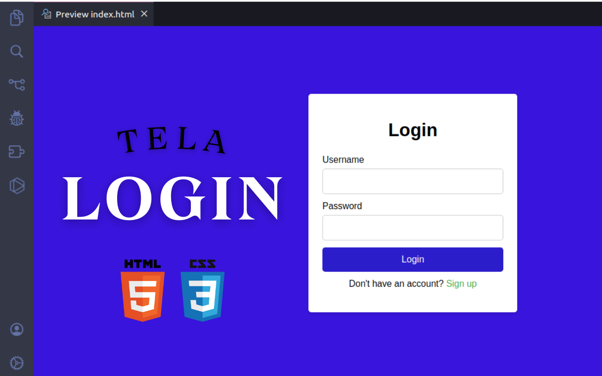

Nesse projeto, temos uma página HTML simples com um formulário de login e uma opção para se cadastrar. 
No corpo, temos o formulário de login e uma opção para se cadastrar. 
O formulário possui três campos:usuário, senha e um botão para efetuar o login. 
Abaixo do formulário, temos a opção de se cadastrar, que redireciona para uma página de cadastro.
Tecnologias Utilizadas :
HTML
CSS 
Baixe o arquivo index.htmle abra-o em um navegador web.
Contribuições são bem-vindas! Sinta-se à vontade .
licença
Esse projeto está licenciado sob a Licença MIT - veja o arquivo LICENSE para mais detalhes.
